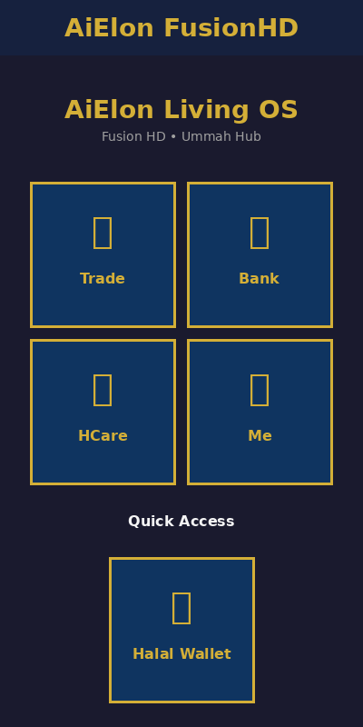

# UI Design Documentation

## Overview
This document showcases the Dark Royal Gold theme implementation and UI design of AiElon FusionHD.

## Color Palette

### Primary Colors
- **Deep Navy**: `#1a1a2e` - Primary background
- **Light Navy**: `#16213e` - Secondary background (headers)
- **Royal Gold**: `#d4af37` - Accent color (borders, text, icons)
- **Card Blue**: `#0f3460` - Button/card backgrounds

### Text Colors
- **Primary Text**: `#f5f5f5` - Off-white
- **Secondary Text**: `#a0a0a0` - Gray

## Screen Mockups

### Home Screen


The home screen features:
- **Header**: App branding with dark navy background and gold text
- **Title Section**: "AiElon Living OS" with subtitle
- **Dashboard Grid**: 2x2 button layout for main modules
  - Trade (📈)
  - Bank (🏦)
  - HCare (🏥)
  - Me (👤)
- **Quick Access**: Separate Halal Wallet button

### Wallet Screen


The wallet screen features:
- **Header**: Navigation with back button and screen title
- **Balance Card**: Prominent display with gold borders
  - Total balance in large gold text
  - Descriptive labels
- **Action Buttons**: Four quick actions
  - Send (💸)
  - Receive (📥)
  - Exchange (🔄)
  - History (📊)
- **Transaction Section**: Placeholder for transaction history

## Design Principles

### Minimalism
- Clean layouts with ample white space
- Limited color palette for focus
- Clear visual hierarchy

### Elegance
- Gold accents on dark backgrounds create luxury feel
- Rounded corners (12-16px) for modern look
- Shadow effects for depth

### Operational Readiness
- Large, tappable buttons (160x160px)
- Clear iconography with text labels
- Consistent spacing (16-32px)
- High contrast for readability

## Button Design

### Dashboard Buttons
- **Size**: 160x160px (square)
- **Background**: Navy blue (#0f3460)
- **Border**: 2px gold (#d4af37)
- **Border Radius**: 16px
- **Shadow**: Gold glow effect
- **Content**: Large emoji icon + bold text

### Action Buttons
- Simpler design for secondary actions
- Icon-first approach
- Consistent spacing

## Typography

### Font Sizes
- **Title**: 32px (bold)
- **Subtitle**: 16px
- **Button Text**: 18px (bold)
- **Body Text**: 16px
- **Small Text**: 14px

### Font Weights
- **Headings**: Bold (700)
- **Buttons**: Bold (700)
- **Body**: Regular (400)
- **Secondary**: Regular (400)

## Spacing System

- **XS**: 4px
- **SM**: 8px
- **MD**: 16px (standard padding)
- **LG**: 24px
- **XL**: 32px (section spacing)
- **XXL**: 48px

## Border Radius

- **Small**: 8px
- **Medium**: 12px
- **Large**: 16px (buttons)
- **XL**: 24px

## Interactive States

### Touch Feedback
- **Active Opacity**: 0.8
- **Transition**: Smooth (React Native default)
- **Hover** (Web): Subtle scale or opacity change

## Accessibility

- High contrast ratios (gold on dark navy)
- Large touch targets (minimum 160px)
- Clear, readable typography
- Icon + text labels for clarity

## Platform Support

The design is optimized for:
- ✅ iOS devices (all screen sizes)
- ✅ Android devices (all screen sizes)
- ✅ Web browsers (responsive)

## Theme Implementation

All design tokens are centralized in `src/theme.js`:
```javascript
export const theme = {
  colors: { ... },
  spacing: { ... },
  borderRadius: { ... },
  fontSizes: { ... }
}
```

This ensures:
- Consistent styling across all components
- Easy theme updates
- Maintainable codebase
- Future dark/light mode toggle support

## Next Steps

Future enhancements could include:
- Animations and transitions
- Gesture controls
- Custom fonts (e.g., Arabic calligraphy)
- Light mode variant
- Accessibility features (screen reader support)
- Internationalization (i18n)
